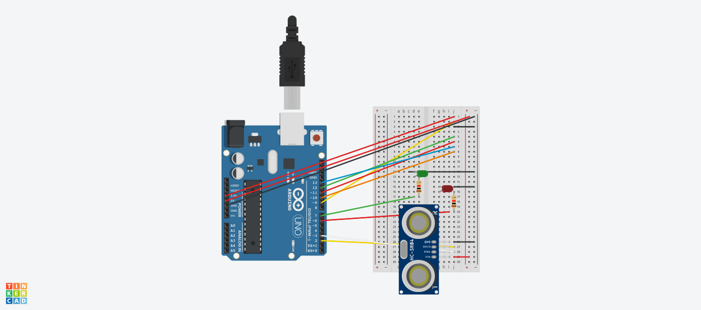

# TollArduino

L'objectif de ce TP est de faire la représentation d'un péage de voiture en NFC.

## Fonctionnement

Lorqu'un véhicule s'approche du péage. Il ne pourra pas passé car la barrière sera fermé (led rouge). Un fois devant la barrière, le véhicule sera vu par un capteur de présence. Le conducteur pourra alors présenter sa carte de passage à la borne NFC. L'uitisateur sera alors invité à donné son nom et prenom si il n'est pas encore enregistré dans la base de donné, un fois enregistré ou reconnu par sa carte NFC. La barrière se lèvera (la led devient vert). Le fois que le véhicule sera passé, donc que le capteur de présent ne verra plus la voiture. La barrière se refermera (la led redeviens rouge). Et le péage attendra donc un nouveau véhicule


## Schema



## Arduino

In folder arduino

## Web

In folder src

## Start project

````npm run start````