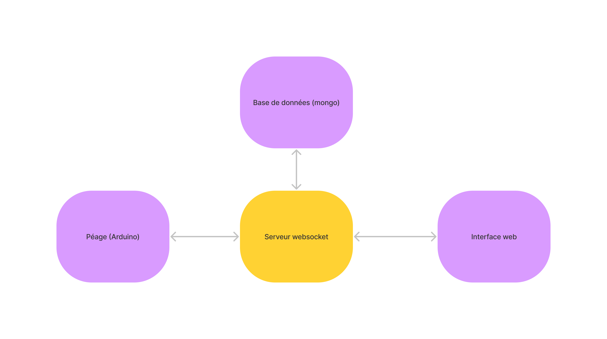

# TollArduino

Le but du projet est de créer un péage de voiture en NFC.

Les utilisateurs peuvent passer uniquement si ils sont équipé d'une carte NFC.

## Membres

- Leon Souffes
- Gabriel Cousin

## Fonctionnement

Lorqu'un véhicule s'approche du péage. Il ne pourra pas passé car la barrière sera fermé (led rouge). Un fois devant la barrière, le véhicule sera vu par un capteur de présence. Le conducteur pourra alors présenter sa carte de passage à la borne NFC. L'uitisateur sera alors invité à donné son nom et prenom si il n'est pas encore enregistré dans la base de donnée, un fois enregistré ou reconnu grace à sa carte NFC. La barrière se lèvera (la led devient vert). Le fois que le véhicule sera passé, donc que le capteur de présent ne verra plus la voiture. La barrière se refermera (la led redeviens rouge). Et le péage attendra donc un nouveau véhicule

## Schema


## Arduino

Le programme arduino se situe dans le dossier : ```/arduino```

On retourve dans ce dossier le programme arduino. et les librairie pour le capteur ultrason.

## Web

Le programme web se situe dans le dossier : ```/src```

La page web permet aux utilisateurs de s'inscrire. Elle permet aussi aux admin d'avoir un retour sous forme de table sur les utilisateurs inscrit et sur leurs passages. Et d'avoir un retour sous forme de schéma sur les statistiques de ses péages.



## Base de donnée

La base de données mongo est composé de deux tables.


## Besoin

1. Carte arduino
2. Capteur de distance ultrason - HC-sr04
3. Capteur NFC - RFID-RC522
4. Led rouge 
5. Led Vert

## Start project

1. Avoir npm d'installé
2. Base de données Mongo sur le port : 27017
3. Téléverser le programme ```arduino/arduino.ino``` sur votre arduino
4. Démarrer le serveur web : ```npm run start```
5. Ouvrir sur un navigateur la page : ```http://localhost:3000```
